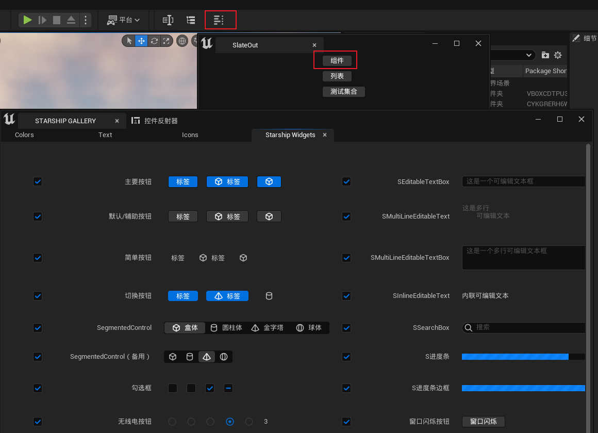

# SlateOut

Unreal官方的Slate案例，写了个快捷入口，方便查找Slate组件

搜索 starshipgallery ，在Runtime/AppFramework下有源码，配合编辑器 工具/调试工具/测试套件可以查看每个组件是如何使用的 

参考、复用了 [EditorPlus](https://github.com/disenone/UE.EditorPlus)、[SlateIconBrowser](https://github.com/sirjofri/SlateStyleBrowser)插件的代码

